# Metal FlashAttention

A faster alternative to Metal Performance Shaders, a reference implementation of modern GPU algorithms, and a step toward defragmenting the AI ecosystem.

Algorithms:
- [ ] Attention
  - [x] Dense (90.5% ALU)
  - [x] Block-Sparse
  - [ ] Triangular
- [ ] Convolution
  - [ ] ConvGEMM 3x3
  - [ ] Winograd 4x4
  - [ ] Winograd 5x5
  - [ ] Winograd 6x6
  - [ ] Winograd 7x7
- [x] GEMM
  - [x] FP16 (93.3% ALU)
  - [x] FP32 (87.2% ALU)
  - [ ] Fused Activations
- [ ] Normalization
  - [ ] Group Normalization

## Usage

| Progamming Language | MFA Supports | MPSGraph Supports | PyTorch Supports |
| ------------------- | ------------ | ------------ | ---------------- |
| CPU C++ (metal-cpp)                | ✅ | ❌ | ✅ |
| GPU C++ (Indirect Command Buffers) | ✅ | ❌ | ❌ | 
| Swift (iPadOS, Playgrounds)        | ✅ | ✅ | ❌ |
| Swift (macOS, Xcode)               | ✅ | ✅ | ✅ |
| Predecessor to Swift       | not tested | ✅ | ✅ |

Usage:
- Download Xcode 14.2 from the Apple [developer tools archive](https://developer.apple.com/download/all/?q=xcode)
- Run the Swift script to compile `libMetalFlashAttention.metallib`
- Read the [API specification](./Documentation/API.md)
- Generate Metal shader variants at runtime

Alternatively:
- Download the newest version of Xcode
- Fetch the Metal library from [GitHub releases](https://github.com/philipturner/metal-flash-attention/releases)
- Run the command-line tool from this repository that validates integrity of the Metal library

## Performance: Overview

SGEMM, every square matrix from 1&ndash;1536:

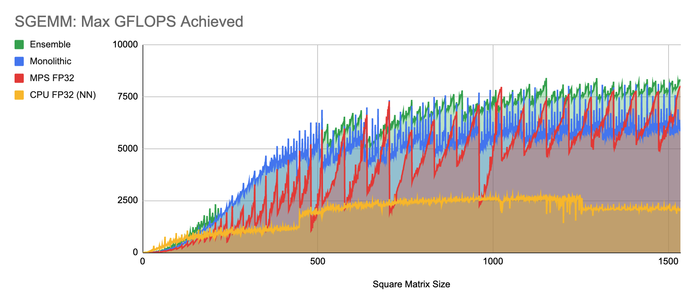

HGEMM, every square matrix from 1&ndash;2048:

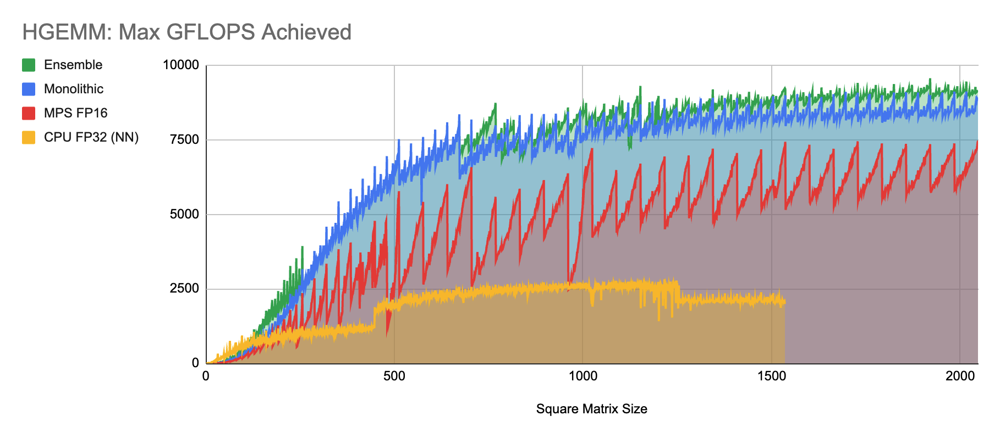

GFLOPS during general matrix multiplication:

| Large Square Sizes | 256 x 256 x 256 | 384 x 384 x 384 | 512 x 512 x 512 | 768 x 768 x 768 | 1024 x 1024 x 1024 | 1280 x 1280 x 1280 | 1440 x 1440 x 1440 |
| ------------------ | ----- | ----- | ----- | ----- | ----- | ----- | ----- |
| Accelerate F64     |   333 |   622 |   616 |   696 |   442 |
| Accelerate F32     |  1223 |  1303 |  2282 |  2679 |  2262 |
| MPS F32            |  1847 |  3216 |  6200 |  6157 |  8153 |  7771 |  6497 |
| MFA F32            |  2760 |  5202 |  7007 |  7739 |  8185 |  8111 |  8472 |
| MPS F16            |  2399 |  4066 |  5849 |  5680 |  7336 |  7102 |  6433 |
| MFA F16            |  3185 |  5945 |  7644 |  8734 |  9353 |  9109 |  9215 |

| Large Square Sizes | 2048 x 2048 x 2048 | 3072 x 3072 x 3072 | 4096 x 4096 x 4096 | 6144 x 6144 x 6144 |
| ------------------ | ----- | ----- | ----- | ----- |
| Accelerate F64     |   536 |   516 |   520 |   504 |
| Accelerate F32     |  1978 |  2058 |  1957 |  1947 |
| MPS F32            |  8472 |  8482 |  8270 | Error |
| MFA F32            |  8992 |  9236 |  9247 |  9257 |
| MPS F16            |  7729 |  7824 |  7771 | Error |
| MFA F16            |  9618 |  9788 |  9778 |  9905 |

## Continuous Integration

Reference system:
- 32-core Apple 7 GPU
- threads/threadgroup:
  $$32 \times \prod_{i=A}^{Z} i_{splits} $$

### GEMM

Scaling by square size:
- Matrix M: every even integer
- Matrix N: every even integer
- Matrix K: every even integer
  
| Function Constant | Value |
| ------ | --------- |
| `M_splits` | 2 |
| `N_splits` | 2 |
| `K_splits` | 1 |
| `M_simd` | Block M / `M_splits` |
| `N_simd` | Block N / `N_splits` |
| `K_simd` | Block K / `K_splits` |
  
| Precision | Block M | Block N | Block K |
| - | - | - | - |
| Float32 | 32 | 32 | 32 |
| Float32 | 48 | 48 | 24 |
| Float16 | 32 | 32 | 32 |
| Float16 | 48 | 48 | 32 |

| Size Start | Size End | Duplicate Commands/Encoder | Trials |
| ---------- | -------- | ---------- | ------ |
| 1 | 190 | 256 | 16 |
| 192 | 254 | 128 | 16 |
| 256 | 382 | 64 | 16 |
| 384 | 510 | 32 | 16 |
| 512 | 766 | 16 | 16 |
| 768 | 1022 | 8 | 16 |
| 1024 | 1534 | 4 | 16 |
| 1536 | 2048 | 2 | 16 |

### Float32 Utilization (NN)
 
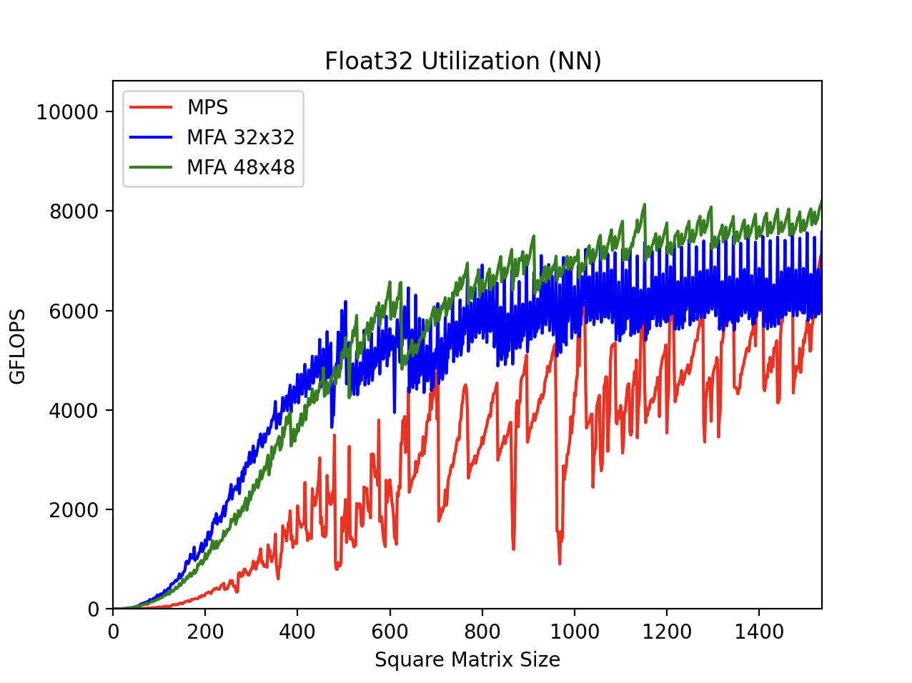

### Float32 Utilization (NT)

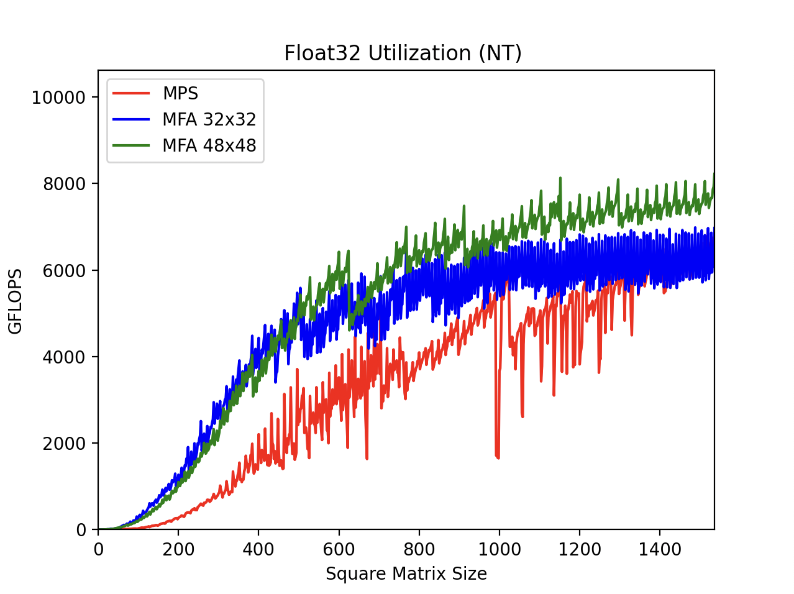

### Float16 Utilization (NN)

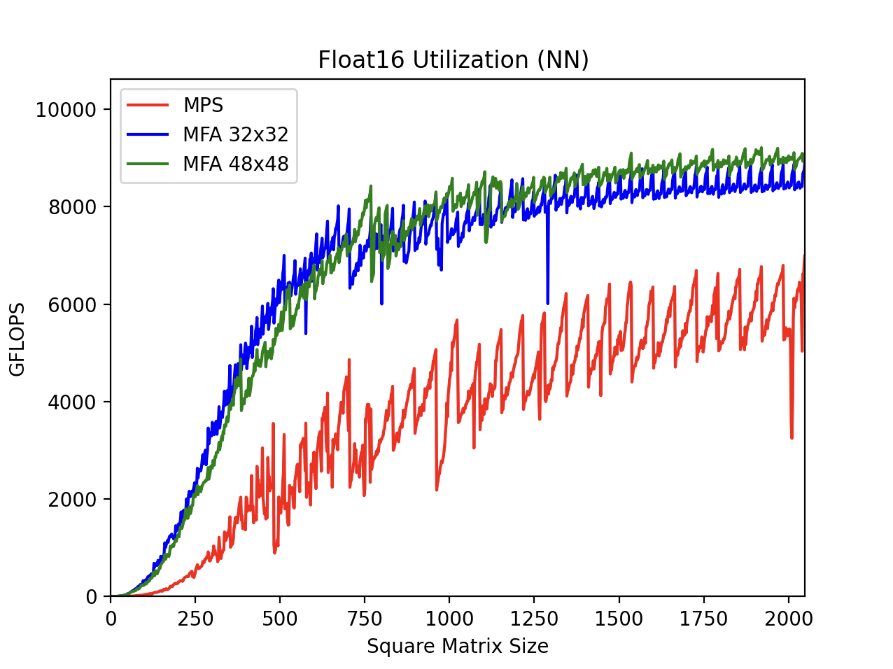

### Float16 Utilization (NT, Batched)

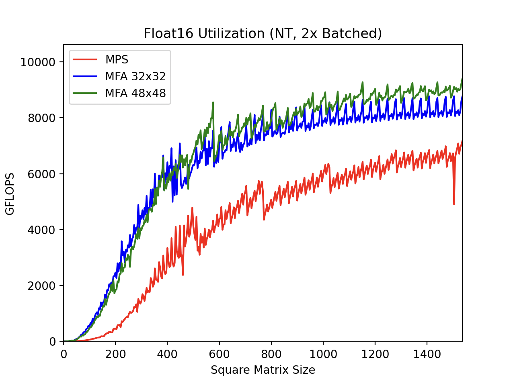

### Attention

Setup:
- Sequence dimension:
  - R = rows (output sequence length)
  - C = columns (input sequence length)
  - R = C
- Masking:
  - Only MFA supports block-sparse masks.
  - For "scaling by sparsity", sparse block size equals GEMM block size.

Scaling by sequence length:
- Masking:
  - No mask
  - Dense Mask: triangular mask
  - Sparse Mask: triangular mask, summarized by block-sparse mask
- Sequence length:
  - Small sequences: every multiple of 4
  - Large sequences: every multiple of 64
  - Causal mask: every even integer
- Head size: 64
- Head count:
  - Small sequences: 10
  - Large sequences: 5
  - Causal mask: 10

Scaling by head size:
- Masking: dense, no mask
- Sequence length 4096
- Head size: every integer
  - &le;64: every integer
  - &gt;64: every `roundUpToPowerOf2(D/64)` integers
- Head count: 8
  
| Function Constant | Value |
| ------ | --------- |
| `Q_trans` | ❌ |
| `K_trans` | ✅ |
| `V_trans` | ❌ |
| `O_trans` | ❌ |
| `R_splits` | TBD |
| `R_simd` | Block R / `R_splits` |
| `C_simd` | Block C |
| `D_simd` | $$8 \times \left \lceil{ \frac{D}{8} }\right \rceil $$  |

### Float32 Sequence Scaling (Small)

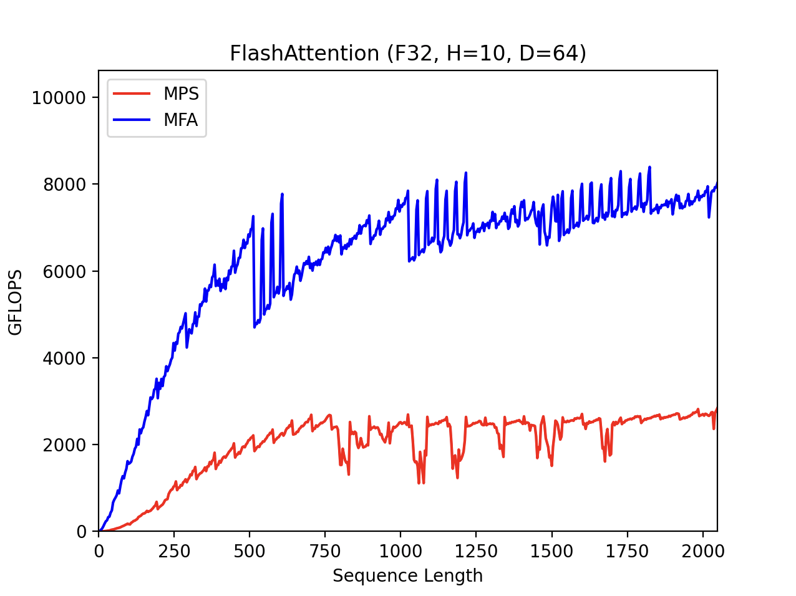

### Float16 Sequence Scaling (Small)

Dense: Stable Diffusion XL outermost attention layer @ 512x512 (sequence length = 1024)

### Float16 Sequence Scaling (Large)

Dense: Stable Diffusion 2 outermost attention layer @ 512x512 (sequence length = 4096)

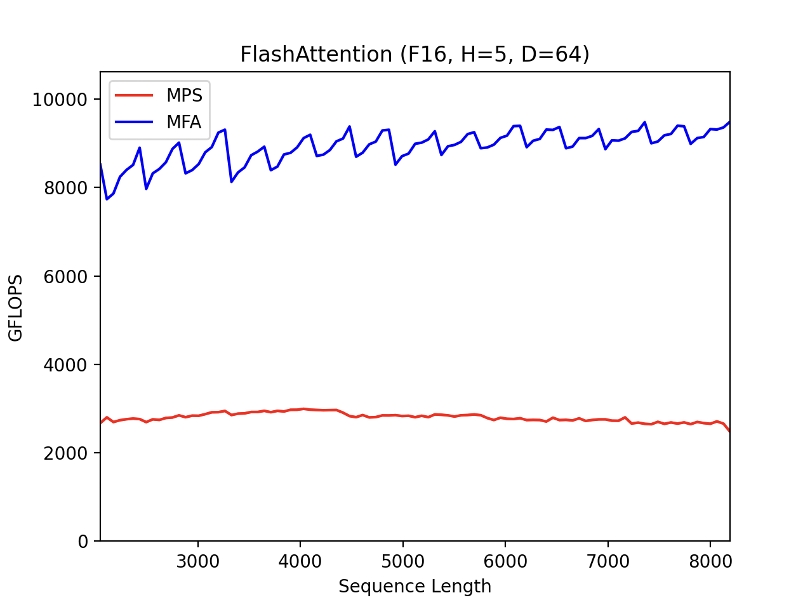

### Float16 Sequence Scaling (Causal Mask)

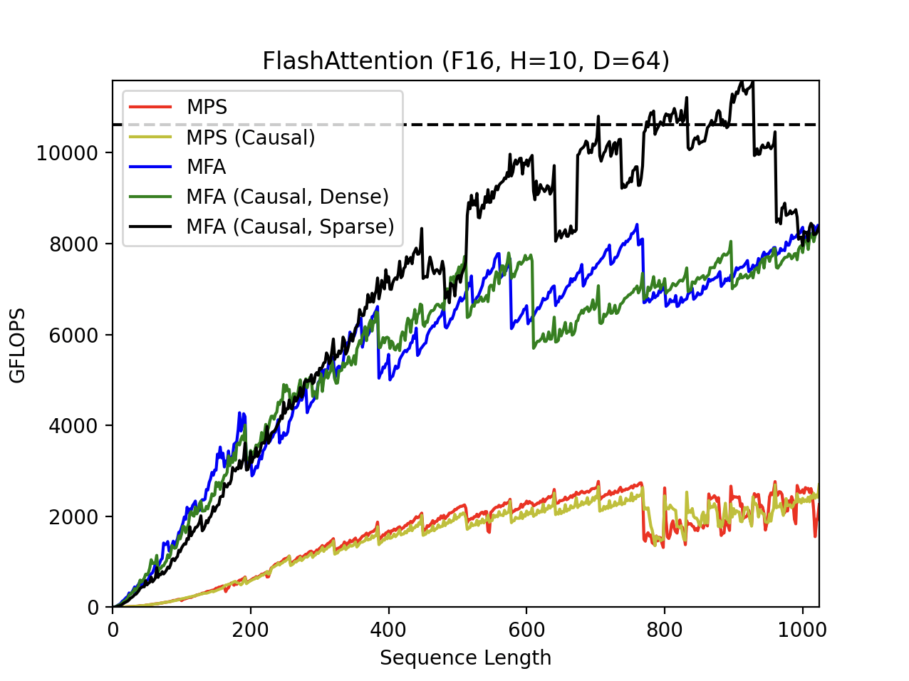

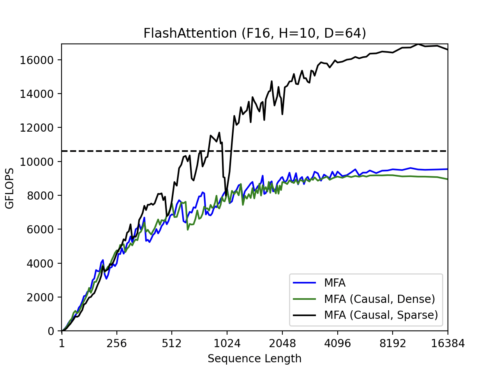

### Float16 Head Scaling

Dense: Stable Diffusion 1 outermost attention layer @ 512x512 (head size = 40)

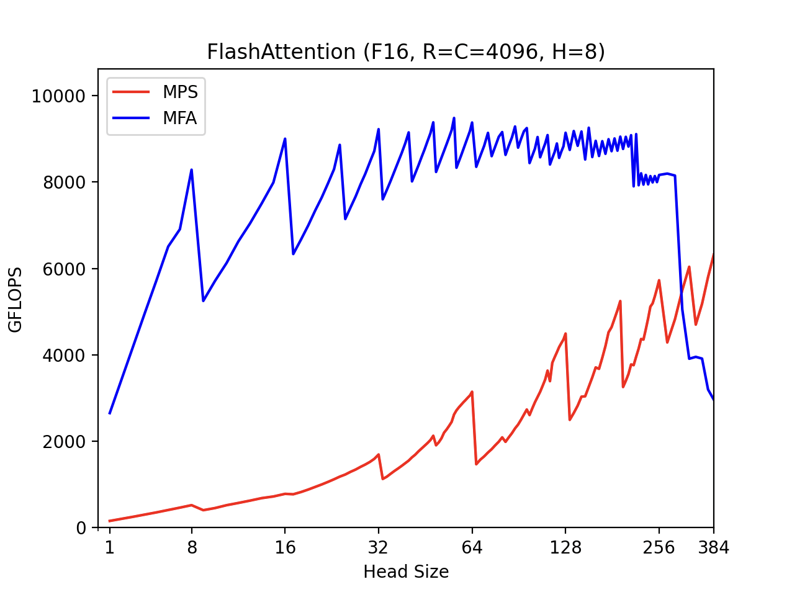

## Roadmap

Releases:
- v0.1.0-alpha
  - Initial release, only non-batched GEMM without fused transposes
- v0.2.0-alpha
  - Fused transposes for A and B
  - Batched GEMM
- v1.0.0
  - Attention: dense, block-sparse, and triangular
- v1.1.0
  - Fused activations
  - Alpha and beta constants from BLAS
  - Grouped-query attention
