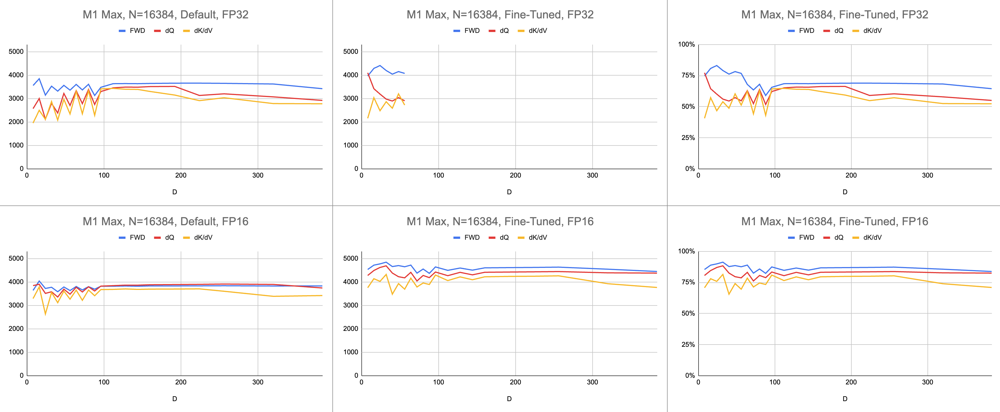
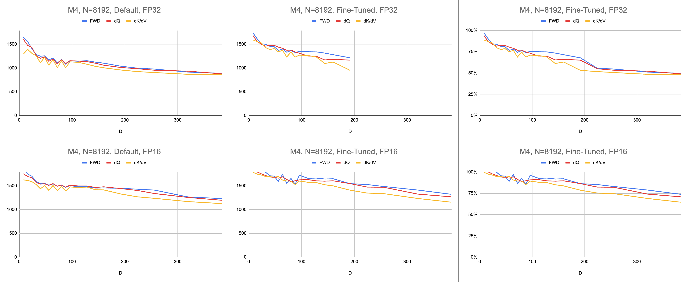

# FlashAttention (Metal Port)

This repository ports the official implementation of [FlashAttention](https://github.com/Dao-AILab/flash-attention) to Apple silicon. It is a minimal, maintainable set of source files that reproduces the FlashAttention algorithm.

## Documentation

Single-headed attention only, to focus on the core bottlenecks of different attention algorithms (register pressure, parallelism). With the basic algorithm done correctly, it should be comparatively trivial to add customizations like block sparsity.

Everything is JIT compiled at runtime. This constrasts with the previous implementation, which relied on an executable embedded in Xcode 14.2.

The backward pass uses less memory than [Dao-AILab/flash-attention](https://github.com/Dao-AILab/flash-attention). The official implementation allocates scratch space for atomics and partial sums. Apple hardware lacks native FP32 atomics (`metal::atomic<float>` is emulated). While attempting to circumvent the lack of hardware support, bandwidth and parallelization bottlenecks in the FlashAttention-2 backward kernel were revealed. An alternative backward pass was designed with higher compute cost (7 GEMMs instead of 5 GEMMs). It achieves 100% parallelization efficiency across both the row and column dimensions of the attention matrix. Most importantly, it is easier to code and maintain.

A lot of crazy stuff was done to overcome register pressure bottlenecks. At large head dimensions (e.g. 256), none of the matrix blocks can fit into registers. Not even the accumulator can. Therefore, intentional register spilling is done, but in a more optimized way. A third block dimension was added to the attention algorithm, which blocks along `D`. The aspect ratio of attention matrix blocks was warped heavily, to minimize the bandwidth cost of register spilling. For example, 16-32 along the parallelization dimension and 80-128 along the traversal dimension. There is a large parameter file that takes the `D` dimension, and determines which operands can fit into registers. It then assigns a block size that balances many competing bottlenecks.

The end result is a consistent 4500 gigainstructions per second on M1 Max (80% ALU utilization), at infinite sequence length and infinite head dimension. Provided BF16 emulation is being used for mixed precision (Metal's `bfloat` has IEEE-compliant rounding, a major overhead on older chips without hardware BF16).





Raw Data: https://docs.google.com/spreadsheets/d/1Xf4jrJ7e19I32J1IWIekGE9uMFTeZKoOpQ6hlUoh-xY/edit?usp=sharing

## Quantifying Performance

In the AI field, performance is most often reported in giga-floating point operations per second (GFLOPS). This metric reflects a simplified model of performance, that every instruction occurs in GEMM. As hardware has advanced from early FPUs to modern vector processors, the most common floating-point operations were fused into a single instruction. Fused multiply-add (FMA). When one multiplies two 100x100 matrices, 1 million FMA instructions are issued. Why must we treat this FMA as two separate instructions?

This question is relevant to attention, where not all floating point operations are created equal. The exponentiation during softmax occurs in a single clock cycle, granted that most of the other instructions go to the FMA unit. Some of the multiplies and adds during softmax, cannot be fused with a nearby add or multiply. Should we treat these the same as FMA, and pretend the hardware is just executing the FMA two times slower? It is unclear how the GEMM performance model can explain whether my shader is using the ALU hardware effectively.

Instead of gigaflops, I use gigainstructions to understand how well the shader is performing. It maps more directly to the algorithm. For example, one GEMM is `N^3` FMA instructions. Forward attention performs two matrix multiplies, or `2 * D * N^2` FMA instructions. Backward attention (by the [Dao-AILab/flash-attention](https://github.com/Dao-AILab/flash-attention) implementation) is `5 * D * N^2` FMA instructions. Try comparing this table to roofline models in the Flash1, Flash2, or Flash3 papers.

| Operation   | Work |
| :---------- | :--- |
| Square GEMM | `N^3`  |
| Forward Attention | `(2D + 5) * N^2` |
| Backward Naive Attention | `4D * N^2` |
| Backward FlashAttention | `(5D + 5) * N^2` |
| FWD + BWD Combined | `(7D + 10) * N^2` | 

Due to the complexity of FP32 atomics, MFA used a different approach for backward pass. This one has higher compute cost. It splits the backward pass into two separate kernels: `dQ` and `dK/dV`. A dropdown shows the pseudocode. Compare this to one of the algorithms in the Flash1, Flash2, or Flash3 papers.

| Operation   | Work |
| :---------- | ---: |
| Forward | `(2D + 5) * N^2` |
| Backward dQ | `(3D + 5) * N^2` |
| Backward dK/dV | `(4D + 5) * N^2` |
| FWD + BWD Combined | `(9D + 15) * N^2` | 

<details>
<summary>Algorithm Pseudocode</summary>

```swift
// Forward
//   for c in 0..<C {
//     load K[c]
//     S = Q * K^T
//     (m, l, P) = softmax(m, l, S * scaleFactor)
//
//     O *= correction
//     load V[c]
//     O += P * V
//   }
//   O /= l
//
//   L = m + logBaseE(l)
//
// Backward Query
//   D = dO * O
//
//   for c in 0..<C {
//     load K[c]
//     S = Q * K^T
//     P = exp(S - L)
//
//     load V[c]
//     dP = dO * V^T
//     dS = P * (dP - D) * scaleFactor
//
//     load K[c]
//     dQ += dS * K
//   }
//
// Backward Key-Value
//   for r in 0..<R {
//     load Q[r]
//     load L[r]
//     S^T = K * Q^T
//     P^T = exp(S^T - L)
//
//     load dO[r]
//     dV += P^T * dO
//
//     load dO[r]
//     load D[r]
//     dP^T = V * dO^T
//     dS^T = P^T * (dP^T - D) * scaleFactor
//
//     load Q[r]
//     dK += dS^T * Q
//   }
```

</details>

Performance is measured by calculating the amount of compute work, then dividing by seconds. The end result is "gigainstructions per second". Next, we need a roofline model. The table below shows rooflines for GINSTRS, calculated as half of GFLOPS. ALU utilization is (actual gigainstructions per second) / (expected gigainstructions per second). For example, M1 Max typically achieves 80% ALU utilization with mixed precision. 

There are limits to this model. It breaks down with the M3 generation at small head dimensions. Different compute units might be utilized simultaneously, making the apparent utilization over 100%. For the most part, the benchmark provides an accurate model of how much performance is left on the table.

```swift
var operations: Int
switch benchmarkedKernel {
case .forward:
  operations = 2 * headDimension + 5
case .backwardQuery:
  operations = 3 * headDimension + 5
case .backwardKeyValue:
  operations = 4 * headDimension + 5
}
operations *= (sequenceDimension * sequenceDimension)
operations *= dispatchCount

// Divide the work by the latency, resulting in throughput.
let instrs = Double(operations) / Double(latencySeconds)
let ginstrs = Int(instrs / 1e9)
```

| Hardware | GFLOPS | GINSTRS |
| :------- | -----: | ------: |
| M1 Max   | 10616  | 5308    |
| M4       | 3580   | 1790    |

How well does the Metal port compare to the official FlashAttention repository? Imagine I went with the "atomic dQ" algorithm and achieved 100% performance. Then, switched to the actual MFA repo and found model training to be 4x slower. That would be 25% of the roofline from the official repository. To get this percentage, multiply the average ALU utilization across all three kernels by `7 / 9`. A more nuanced model was used for the statistics on Apple hardware, but this is the gist of it.

To calculate utilization on Nvidia hardware, the GFLOPS for FP16/BF16 was used. I divided the GFLOPS from the graph in the paper by 312000 (A100 SXM), 989000 (H100 SXM). Even for the FP8 data points. Keeping the denominator constant makes it easier to compare FP16 to FP8. Notice that, for larger head dimensions and more register pressure heavy kernels (backward), no benchmarks we reported. Perhaps because the main repo has not yet solved the register pressure issue at infinite head dimensions. For example, the accumulator might always be held in registers.

### GFLOPS

| A100, Flash2       | D = 64  | D = 128 | D = 256 |
| :----------------- | ------: | ------: | ------: |
| Forward            | 192000  | 223000  | n/a     |
| Backward           | 170000  | 196000  | n/a     |
| Forward + Backward | 176000  | 203000  | n/a     |

| H100, Flash3       | D = 64  | D = 128 | D = 256 |
| :----------------- | ------: | ------: | ------: |
| Forward (FP8)      | 613000  | 1008000 | 1171000 |
| Forward            | 497000  | 648000  | 756000  |
| Backward (FP8)     | n/a     | n/a     | n/a     |
| Backward           | 474000  | 561000  | n/a     |
| Forward + Backward (FP8) | n/a  | n/a  | n/a     |
| Forward + Backward | 480000  | 585000  | n/a     |

### Compute Utilization

| A100, Flash2       | D = 64  | D = 128 | D = 256 |
| :----------------- | ------: | ------: | ------: |
| Forward            |
| Forward + Backward |

## Usage

### Setting Up Workflow

On macOS, download the Swift package and compile with `-Xswiftc -Ounchecked`. This compiler option is needed for performance-sensitive CPU code. Release mode cannot be used because it forces the entire codebase to be recompiled from scratch, every time there is a single change. Navigate to the Git repo in Finder and double-click `Package.swift`. An Xcode window should pop up. On the left, there should be a hierarchy of files. If you cannot unravel the hierarchy, something went wrong.

```
git clone https://github.com/philipturner/metal-flash-attention
swift build -Xswiftc -Ounchecked # Does is even compile?
swift test -Xswiftc -Ounchecked # Does the test suite finish in ~10 seconds?
```

Alternatively, create a new Xcode project with the SwiftUI template. Override the `"Hello, world!"` string with a call to a function that returns a `String`. This function will execute the script of your choosing, then call `exit(0)`, so the app crashes before rendering anything to the screen. You will use the output in the Xcode console as feedback about your code. This workflow is compatible with both macOS and iOS.

Specify `-Xswiftc -Ounchecked` through <b>Project</b> > your project's name > <b>Build Settings</b> > <b>Swift Compiler - Code Generation</b> > <b>Optimization Level</b>. The second column of the table lists your project's name. Click <b>Other</b> in the dropdown and type `-Ounchecked` in the panel that appears. Next, add this repository as a Swift package dependency. Look through some of the tests under `Tests/FlashAttention`. Copy the raw source code for one of these tests into your project. Invoke the test from the function in the previous paragraph. Examine what it displays on the console.

To modify the kernel generation code (e.g. add multi-head or mask support), copy the raw source code into your Xcode project. Either use `git clone` in a separate folder, or download the raw files on GitHub as a ZIP. There is also a way to link to your fork of `metal-flash-attention` and autosave your changes to the cloud, but this is more difficult to set up. Remove the Swift package dependency from the previous paragraph. Re-run the test of your choosing. Does it compile and display something in the console?

### Editing Source Code

Locate of the multi-line string literals in either of these folders:

```
Sources/FlashAttention/Attention/AttentionKernel
Sources/FlashAttention/GEMM/GEMMKernel
```

Add random text to one of them. Compile and run the project again. Something should go terribly wrong. For example, the Metal compiler may throw an error. If this does not happen, try messing up a different line of code somewher else. If the test still passes, Xcode is not registering your changes.

Proceed with coding up [block sparsity](https://pytorch.org/blog/flexattention/) or something. Get feedback about whether the code works at all, whether it works fast, and whether it works fast for any problem size. Then integrate the raw source code into your app, or translate it to another language.
