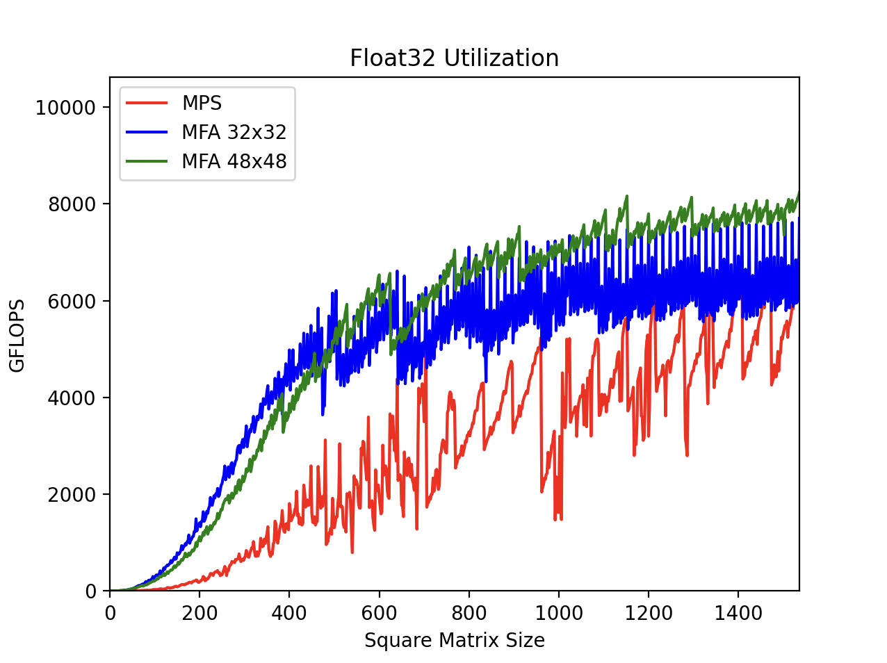
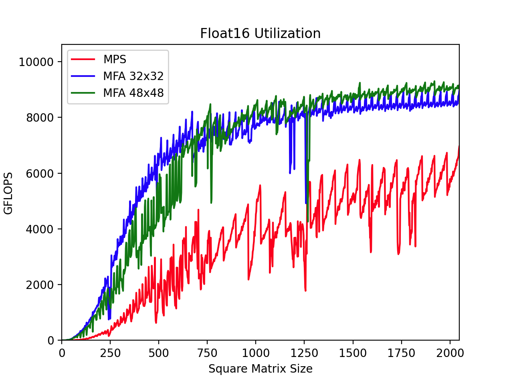

# Metal FlashAttention

A faster alternative to Metal Performance Shaders, a reference implementation of modern GPU algorithms, and a step toward defragmenting the AI ecosystem.

Algorithms:
- [ ] Attention
  - [ ] Dense FlashAttention (TBD% ALU @ 64 heads)
  - [ ] Triangular FlashAttention (TBD% ALU effective @ 64 heads)
- [ ] Convolution
  - [ ] ConvGEMM 1x1 (TBD% ALU)
  - [ ] ConvGEMM 3x3 (TBD% ALU)
  - [ ] Winograd 4x4 (TBD% ALU effective)
  - [ ] Winograd 5x5 (TBD% ALU effective)
  - [ ] Winograd 6x6 (TBD% ALU effective)
- [x] GEMM
  - [x] FP16 (93.3% ALU)
  - [x] FP32 (87.2% ALU)
  - [x] SIMD Futures
  - [x] [Stream-K](https://arxiv.org/abs/2301.03598)
  - [ ] Fused Activations
- [ ] Normalization
  - [ ] Group Normalization (TBD% SLC Bandwidth)

## Usage

| Progamming Language | MFA Supports | MPSGraph Supports | PyTorch Supports |
| ------------------- | ------------ | ------------ | ---------------- |
| CPU C++ (metal-cpp)                | ✅ | ❌ | ✅ |
| GPU C++ (Indirect Command Buffers) | ✅ | ❌ | ❌ | 
| Swift (iPadOS, Playgrounds)        | ✅ | ✅ | ❌ |
| Swift (macOS, Xcode)               | ✅ | ✅ | ✅ |
| Predecessor to Swift       | not tested | ✅ | ✅ |

Usage:
- Download Xcode 14.2 from the Apple [developer tools archive](https://developer.apple.com/download/all/?q=xcode)
- Run the Swift script to compile `libMetalFlashAttention.metallib`
- Read the [API specification](./Documentation/API.md)
- Generate Metal shader variants at runtime

Alternatively:
- Download the newest version of Xcode
- Fetch the Metal library from [GitHub releases](https://github.com/philipturner/metal-flash-attention/releases)
- Run the command-line tool from this repository that validates integrity of the Metal library

## Performance: Overview

SGEMM, every square matrix from 1&ndash;1536:

HGEMM, every square matrix from 1&ndash;2048:

GFLOPS during general matrix multiplication:

| Large Square Sizes | 256 x 256 x 256 | 384 x 384 x 384 | 512 x 512 x 512 | 768 x 768 x 768 | 1024 x 1024 x 1024 | 1280 x 1280 x 1280 | 1440 x 1440 x 1440 |
| ------------------ | ----- | ----- | ----- | ----- | ----- | ----- | ----- |
| Accelerate F64     |   333 |   622 |   616 |   696 |   442 |
| Accelerate F32     |  1223 |  1303 |  2282 |  2679 |  2262 |
| MPS F32            |  1847 |  3216 |  6200 |  6157 |  8153 |  7771 |  6497 |
| MFA F32            |  2760 |  5202 |  7007 |  7739 |  8185 |  8111 |  8472 |
| MPS F16            |  2399 |  4066 |  5849 |  5680 |  7336 |  7102 |  6433 |
| MFA F16            |  3185 |  5945 |  7644 |  8734 |  9353 |  9109 |  9215 |

| Large Square Sizes | 2048 x 2048 x 2048 | 3072 x 3072 x 3072 | 4096 x 4096 x 4096 | 6144 x 6144 x 6144 |
| ------------------ | ----- | ----- | ----- | ----- |
| Accelerate F64     |   536 |   516 |   520 |   504 |
| Accelerate F32     |  1978 |  2058 |  1957 |  1947 |
| MPS F32            |  8472 |  8482 |  8270 | Error |
| MFA F32            |  8992 |  9236 |  9247 |  9257 |
| MPS F16            |  7729 |  7824 |  7771 | Error |
| MFA F16            |  9618 |  9788 |  9778 |  9905 |

## Continuous Integration

Setup:
- Every square matrix size divisible by 2
- 32-core Apple 7 GPU
- NN multiplication (no transposes)
- 128 threads/threadgroup (no K-splits)

### Float32

| Size Start | Size End | Duplicate Commands/Encoder | Trials |
| ---------- | -------- | ---------- | ------ |
| 1 | 191 | 256 | 8 |
| 192 | 255 | 128 | 8 |
| 256 | 383 | 64 | 8 |
| 384 | 511 | 32 | 8 |
| 512 | 767 | 16 | 8 |
| 768 | 1023 | 8 | 8 |
| 1024 | 1536 | 4 | 8 |
 

### Float16

| Size Start | Size End | Duplicate Commands/Encoder | Trials |
| ---------- | -------- | ---------- | ------ |
| 1 | 191 | 256 | 8 |
| 192 | 255 | 128 | 8 |
| 256 | 383 | 64 | 8 |
| 384 | 511 | 32 | 8 |
| 512 | 767 | 16 | 8 |
| 768 | 1023 | 8 | 8 |
| 1024 | 1535 | 4 | 8 |
| 1536 | 2048 | 2 | 8 |

### Regressions

There are likely either random register spills or unneeded zero-initialization during the SIMD async copy instructions. MPS is noticeably slower than in previous tests, likely due to a sequential throughput bottleneck. 48x48 has consistently faster performance than 32x32, but is randomly drastically slower.
